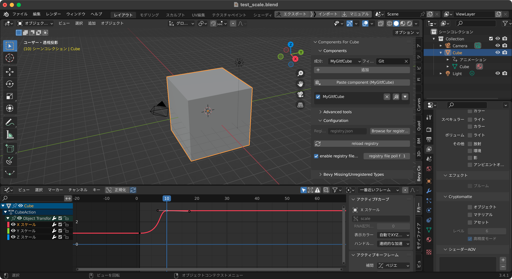
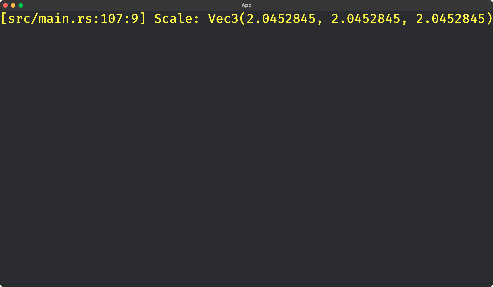

# bevy_gltf_animation_test_240505

This is a test project to read animated transform data from a glTF file, without display it (hidden), using [bevy_gltf_components](https://github.com/kaosat-dev/Blender_bevy_components_workflow/tree/main/tools/bevy_components).

